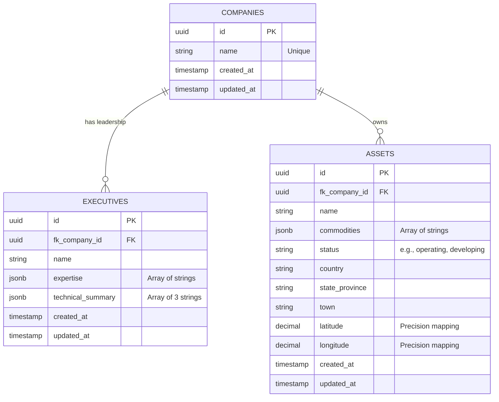

# Harpia Group - Mining Intelligence Data Pipeline

**Author:** Yann Gabriel  
**Challenge:** Technical Bounty - Mining Intelligence Data Pipeline (Search & Vectorization)

## 📌 Project Overview
This project is an end-to-end autonomous data pipeline designed to ingest a list of mining companies, search the web for relevant intelligence, and structure that unstructured data into a relational and vector database. The system extracts key information regarding the company's technical leadership and physical mining assets, serving it through a clean, lightweight user interface.

## 🏗️ Architecture & Tech Stack

While Python and Node.js are common defaults for orchestration, I intentionally architected this solution using **Laravel (PHP)** for the backend and orchestration, paired with **Angular** for the frontend and **Supabase (Postgres + pgvector)** for the database. 

### Strategic Architectural Decision: Why Laravel?
As an Architect, system design requires balancing perfect theoretical stacks with extreme pragmatism—especially within a strict 48-hour delivery window. I chose Laravel for the core orchestration engine due to the following strategic advantages:

1. **Pragmatism & Time-to-Market:** The evaluation criteria emphasize delivering a robust, working core model. Laravel's robust ecosystem (routing, ORM, migrations, and HTTP clients) allows for rapid, error-resilient scaffolding, freeing up the majority of the 48 hours to focus on the highest-value tasks: Prompt Engineering, Agentic Extraction, and Vector Search.
2. **Concurrent Processing (Bonus Point):** To process multiple companies simultaneously rather than sequentially, Laravel provides an enterprise-grade, built-in Queue system. By dispatching `ProcessCompanyIntelligence` jobs to background workers running in Docker, the pipeline scales horizontally and handles API rate limits efficiently.
3. **Resilience & Error Handling:** Dealing with LLMs and web scraping inherently involves failures (e.g., pages not listing assets, timeouts). Laravel's HTTP Client gracefully handles retries, timeouts, and payload validation, ensuring the pipeline doesn't break when encountering dirty unstructured data.

### The Stack:
* **Backend / Orchestrator:** Laravel 12 (REST API & Queue Workers)
* **Frontend:** Angular (Lightweight UI/Dashboard)
* **Database:** Supabase (PostgreSQL with `pgvector` for semantic search)
* **Search / Scrape:** Firecrawl API
* **Intelligence / LLM:** Google Gemini API (Structured Outputs & Embeddings)
* **Infrastructure:** Docker & Docker Compose

## ⚙️ Data Flow & Pipeline
1. **Input:** The UI accepts a comma-delimited string of company names (e.g., "BHP, Evolution Mining").
2. **Agentic Ingestion:** The backend dispatches a concurrent job for each company. It queries the Firecrawl API to search and scrape the most relevant pages regarding the Board of Directors and Mining Assets.
3. **Extraction & Intelligence:** The raw markdown is sent to the Gemini API. Strict prompt engineering forces the LLM to return structured JSON containing executives (with technical summaries) and assets (with coordinates).
4. **Domain Validation:** The LLM evaluates if the context belongs to a real mining company. False positives (e.g., Apple Inc.) are gracefully discarded.
5. **Storage:** Relational data is mapped and stored in the Supabase PostgreSQL database.

*Note: The exact system prompts used for the LLM extraction can be found in the `prompts.txt` file at the root of this repository.*

## 🗄️ Database Architecture & Schema

The database was modeled to be highly normalized and tailored for relational mapping. 

### Entity-Relationship Diagram


## 🛣️ API Endpoints

A robust REST API was implemented to manage the pipeline and serve the extracted intelligence:

| Method | Endpoint | Description |
| :--- | :--- | :--- |
| `POST` | `/api/companies/process` | Accepts a string of companies, validates limits (max 10), and dispatches concurrent jobs. |
| `GET` | `/api/companies` | Returns a paginated list (10/page) of processed companies with search filtering. |
| `GET` | `/api/companies/{id}` | Returns full details of a company, including its leadership and assets. |

## 🛡️ Resilience & Error Handling

To ensure the pipeline handles the unpredictability of LLMs and web scraping, we implemented:

- **Automatic Retries:** Jobs are configured with 3 retries. If the Gemini API or Firecrawl fails, the job is released back to the queue for another attempt.
- **Domain Validation:** A specialized system prompt forces the AI to validate if the company is in the mining sector. If not, it returns empty data, preventing "ghost" records.
- **Transaction Safety:** Database operations use SQL Transactions to ensure atomic updates (preventing partial data saves when an error occurs).
- **PgBouncer Compatibility:** The backend is configured to work with Supabase's connection pooler using statement emulation to avoid transaction aborted errors.

## 🧪 Testing Strategy

Quality is ensured through a comprehensive feature testing suite that uses mocks to avoid API costs:

- **Controller Tests:** Validates batch limits, search input cleaning, pagination, and deduplication.
- **Service Tests:** Mocks `Http::fake()` to simulate Gemini/Firecrawl responses, covering edge cases like invalid JSON or API failures.
- **Job Tests:** Orchestration tests that confirm the full pipeline flow from scraping to database storage without real API calls.
- **Safe Run:** All tests use `Queue::fake()` or `Http::fake()` to ensure zero token consumption during development.

---

## � Cost Estimation (10,000 Companies/Month)

A core architectural goal was to minimize token usage and infrastructure costs while maintaining high precision. Here is the estimated monthly cost to process **10,000 companies**.

**1. Data Ingestion (Firecrawl):**
* Assuming 1 search/scrape operation per company = 10,000 operations.
* Standard API cost is roughly $0.001 per credit.
* **Estimated Cost:** ~$10.00 / month.

**2. AI Extraction (Gemini 3 Flash Preview):**
* *Why Flash 3?* Released in late 2025, Gemini 3 Flash was chosen for its state-of-the-art token efficiency, ultra-low latency, and enhanced support for complex JSON structured outputs.
* Assuming an average of 10,000 tokens (input) and 500 tokens (output) per company scraped context.
* Total Input: ~100 Million tokens ($0,50 per 1M) = $50.00.
* Total Output: ~5 Million tokens ($3.00 per 1M) = $15.00.
* **Estimated Cost:** ~$65.00 / month.

**3. Infrastructure (Database & Orchestration):**
* Supabase (Postgres): Pro Tier = $25.00 / month.

**Total Estimated Monthly Pipeline Cost:** ~ $85.00 
*(Highly scalable and optimized for the latest Gemini 3 architecture).*

## 🔮 Future Architecture (System Design)
While the current MVP focuses on relational extraction, the system is designed to easily accommodate the **Vector Database & RAG** requirement. The next iteration would introduce a `KNOWLEDGE_BASE` table with a `vector embedding` column using `pgvector`. During Step 3 of the pipeline, the raw markdown would be chunked and embedded via Gemini's embedding models, allowing users to query the raw context semantically.

---

## �🛠️ Initial Setup

Follow these steps to prepare your environment before running the containers.

### 1. Prerequisites
- **Docker & Docker Compose** installed.
- **API Keys**: You will need a `FIRECRAWL_API_KEY` and a `GEMINI_API_KEY`.
- **Supabase Account**: A PostgreSQL instance.

### 2. Environment Configuration
Create a `.env` file in the `backend/` directory:

```bash
# Clone the repository
git clone <repository-url>
cd mining-pipeline

# Prepare the backend environment
cp backend/.env.example backend/.env
```

Edit the `backend/.env` with your credentials:
```env
DB_CONNECTION=pgsql
DB_HOST=your_supabase_hostname_here
DB_PORT=6543 # or 5432 for direct connection
DB_DATABASE=postgres
DB_USERNAME=your_supabase_user
DB_PASSWORD=your_supabase_password
DB_SSLMODE=require

FIRECRAWL_API_KEY=your_firecrawl_key
GEMINI_API_KEY=your_gemini_key

QUEUE_CONNECTION=database
DB_QUEUE=mining
```

---

## 🚀 Running the Project

The entire stack is orchestrated using Docker Compose for high portability.

### 1. Build and Start Containers
Run the following command from the root directory:
```bash
docker compose up -d --build
```
This will start:
- **`harpia_backend`**: Laravel API serving on `http://localhost:8000`
- **`harpia_queue`**: Background worker for concurrent intelligence processing.
- **`harpia_frontend`**: Angular Dashboard serving on `http://localhost:4200`

### 2. Database Migrations
Run the migrations to set up the tables and pgvector extension in your Supabase instance:
```bash
docker exec harpia_backend php artisan migrate
```

### 3. Running Tests (Optional)
To verify the installation and ensure all services are working correctly (without consuming API tokens):
```bash
docker exec harpia_backend php artisan test
```

### 4. Accessing the Services
- **Frontend Dashboard**: `http://localhost:4200`
- **API Health Check**: `http://localhost:8000/up`

### 5. Basic Usage Example
Trigger the pipeline via CLI or Postman:

**Start extraction:**
```bash
curl -X POST http://localhost:8000/api/companies/process \
     -H "Content-Type: application/json" \
     -d '{"companies": "BHP, Vale"}'
```

**Check results:**
```bash
curl http://localhost:8000/api/companies
```

---

## 🔄 Project Lifecycle

| Action | Command | Description |
| :--- | :--- | :--- |
| **Stop** | `docker compose stop` | Standard stop (fast). |
| **Start** | `docker compose start` | Resume after stop. |
| **Down** | `docker compose down` | Remove containers/networks. |
| **Logs** | `docker compose logs -f queue` | View real-time AI processing. |
| **Fresh Start** | `docker compose up -d --build` | Rebuild after file changes. |

### Dependencies
The Docker environment handles everything. To manually update PHP packages:
```bash
docker exec harpia_backend composer install
```