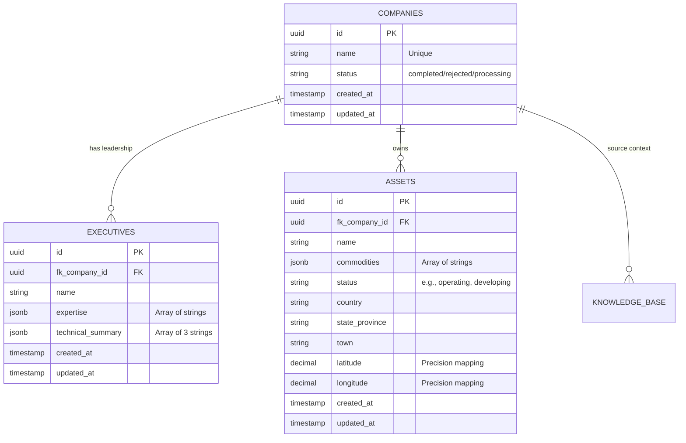

# Harpia Group - Mining Intelligence Data Pipeline

**Author:** Yann Gabriel  
**Challenge:** Technical Bounty - Mining Intelligence Data Pipeline (Search & Vectorization)

## 📌 Project Overview
This project is an end-to-end autonomous data pipeline designed to ingest a list of mining companies, search the web for relevant intelligence, and structure that unstructured data into a relational and vector database. The system extracts key information regarding the company's technical leadership and physical mining assets, serving it through a clean, lightweight user interface.

## 🏗️ Architecture & Tech Stack

While Python and Node.js are common defaults for orchestration, I intentionally architected this solution using **Laravel (PHP)** for the backend and orchestration, paired with **Angular** for the frontend and **Local PostgreSQL (pgvector)** for the database. 

### Strategic Architectural Decision: Why Laravel?
As an Architect, system design requires balancing perfect theoretical stacks with extreme pragmatism—especially within a strict 48-hour delivery window. I chose Laravel for the core orchestration engine due to the following strategic advantages:

1. **Pragmatism & Time-to-Market:** The evaluation criteria emphasize delivering a robust, working core model. Laravel's robust ecosystem (routing, ORM, migrations, and HTTP clients) allows for rapid, error-resilient scaffolding, freeing up the majority of the 48 hours to focus on the highest-value tasks: Prompt Engineering, Agentic Extraction, and Vector Search.
2. **Concurrent Processing (Bonus Point):** To process multiple companies simultaneously rather than sequentially, Laravel provides an enterprise-grade, built-in Queue system. By dispatching `ProcessCompanyIntelligence` jobs to background workers running in Docker, the pipeline scales horizontally and handles API rate limits efficiently.
3. **Resilience & Error Handling:** Dealing with LLMs and web scraping inherently involves failures (e.g., pages not listing assets, timeouts). Laravel's HTTP Client gracefully handles retries, timeouts, and payload validation, ensuring the pipeline doesn't break when encountering dirty unstructured data.

### The Stack:
* **Backend / Orchestrator:** Laravel 12 (REST API & Queue Workers)
* **Frontend:** Angular (Lightweight UI/Dashboard)
* **Database:** Local PostgreSQL (with `pgvector` for semantic search)
* **Search / Scrape:** Firecrawl API
* **Intelligence / LLM:** Google Gemini API (Structured Outputs & Embeddings)
* **Infrastructure:** Docker & Docker Compose

## ⚙️ Data Flow & Pipeline
1. **Input:** The UI accepts a comma-delimited string of company names (e.g., "BHP, Evolution Mining").
2. **Exhaustive Ingestion:** The backend dispatches concurrent jobs for each company. It uses **Firecrawl API** with specialized queries (Leadership vs. Assets) and increased limits (3-4 results per scope) to ensure no mining project is left behind.
3. **Intelligent Caching:** Scraped markdown is cached for **2 hours** (`Laravel Cache`). This prevents redundant API costs when retrying jobs or performing similar lookups.
4. **Agentic Extraction:** The raw context (up to 80,000 characters) is analyzed by **Gemini**. Strict prompt engineering mandates an **exhaustive** extraction of ALL listed board members and EVERY physical asset mentioned.
5. **Domain Validation:** Explicit decision via `is_mining_sector` boolean. Non-mining hits generate a **Negative Cache** record (`status: rejected`) to block future costly re-processes.
6. **Storage:** Data is mapped with a lifecycle status (`processing`, `completed`, `rejected`).

## 🗄️ Database Architecture & Schema

The database was modeled to be highly normalized, prepared for both relational intelligence and future semantic vectorization.

### Entity-Relationship Diagram


## 🛣️ API Endpoints

A robust REST API was implemented to manage the pipeline and serve the extracted intelligence:

| Method | Endpoint | Description |
| :--- | :--- | :--- |
| `POST` | `/api/companies/process` | Accepts a string of companies, validates limits (max 10), and dispatches concurrent jobs. |
| `GET` | `/api/companies/status` | Real-time queue monitor for the UI. |
| `GET` | `/api/companies` | Returns a paginated list (10/page) of processed companies with search filtering. |
| `GET` | `/api/companies/{id}` | Returns full details of a company, including its leadership and assets. |

## 🛡️ Resilience & Error Handling

To ensure the pipeline handles the unpredictability of LLMs and web scraping, we implemented:

- **Exponential Backoff:** Jobs utilize a delayed retry strategy (`[60, 120]` seconds) if APIs encounter rate limits or temporary outages.
- **Exhaustive Safety:** Automatic truncation of contexts at **80,000 characters**. This maximizes data capture for the LLM while preventing "token explosion" costs.
- **Negative Caching:** Rejected companies are stored for 24h to prevent re-processing non-relevant terms.
- **Transaction Integrity:** Uses database transactions to ensure that either full intelligence is saved (Executives + Assets + Status) or nothing at all, preventing "ghost" partial records.
- **PgVector Integration:** Direct integration with the local database container for ultra-low latency vector operations.

## 🧪 Testing Strategy

Quality is ensured through a comprehensive feature testing suite that uses mocks to avoid API costs:

- **Controller Tests:** Validates batch limits, search input cleaning, pagination, and deduplication.
- **Service Tests:** Mocks `Http::fake()` to simulate Gemini/Firecrawl responses, covering edge cases like exhaustive discovery, invalid JSON, or API failures.
- **Job Tests:** Orchestration tests that confirm the full pipeline flow, including caching logic and database storage, without real API calls.
- **Safe Run:** All tests use `Queue::fake()` or `Http::fake()` to ensure zero token consumption during development.

---

## 💰 Cost Estimation (10,000 Companies/Month)

A core architectural goal was to provide high precision (Exhaustive Discovery) while maintaining extreme token efficiency. Estimates below reflect the **Exhaustive Extraction** update.

**1. Data Ingestion (Firecrawl):**
* 2 Specialized Searches/Scrapes per company (Leadership/Assets).
* Total Credits: ~70,000 credits (assuming exhaustive page discovery).
* **Estimated Cost:** ~$70.00 / month.

**2. AI Extraction (Gemini 3 Flash Preview):**
* *Why Flash 3?* Released in late 2025, Gemini 3 Flash was chosen for its state-of-the-art token efficiency, ultra-low latency, and enhanced support for complex JSON structured outputs.
* Assuming an average of 10,000 tokens (input) and 500 tokens (output) per company scraped context.
* Total Input: ~100 Million tokens ($0,50 per 1M) = $50.00.
* Total Output: ~5 Million tokens ($3.00 per 1M) = $15.00.
* **Estimated Cost:** ~$65.00 / month.

**3. Infrastructure (Database & Orchestration):**
* Local PostgreSQL / Dockerized Workers: **$0.00** (Self-hosted/Standard VPS).

**Total Estimated Monthly Pipeline Cost:** ~ $135.00 
*(Exhaustive discovery for 10,000 companies at less than $0.017 per lead).*

## 🔮 Vector-Ready Infrastructure (pgVector)
The project is fully prepared for **Vector Intelligence**. The current implementation includes:
1. **Container Support:** Deployment of `pgvector/pgvector:pg15` via Docker Compose.
2. **Database Schema:** A `knowledge_bases` table with a native `vector(768)` column (Migration 2026_02_23_222626).
3. **Relational Mapping:** Eloquent models are configured to link companies to their raw context and semantic embeddings.

*Status: Infrastructure and Database layers are active. The application logic for real-time embedding generation is prepared for the next release module.*

---

## 🛠️ Initial Setup

Follow these steps to prepare your environment before running the containers.

### 1. Prerequisites
- **Docker & Docker Compose** installed.
- **API Keys**: You will need a `FIRECRAWL_API_KEY` and a `GEMINI_API_KEY`.

### 2. Environment Configuration
Create a `.env` file in the `backend/` directory:

```bash
# Clone the repository
git clone <repository-url>
cd mining-pipeline

# Prepare the backend environment
cp backend/.env.example backend/.env
```

Edit the `backend/.env` with your credentials (pre-configured for Docker):
```env
DB_CONNECTION=pgsql
DB_HOST=db
DB_PORT=5432
DB_DATABASE=mining_db
DB_USERNAME=user_admin
DB_PASSWORD=password_secure
DB_SSLMODE=prefer

FIRECRAWL_API_KEY=your_firecrawl_key
GEMINI_API_KEY=your_gemini_key

QUEUE_CONNECTION=database
DB_QUEUE=mining
```

---

## 🚀 Running the Project

The entire stack is orchestrated using Docker Compose for high portability.

### 1. Build and Start Containers
Run the following command from the root directory:
```bash
docker compose up -d --build
```
This will start:
- **`harpia_backend`**: Laravel API serving on `http://localhost:8000`
- **`harpia_queue`**: Background worker for concurrent intelligence processing.
- **`harpia_frontend`**: Angular Dashboard serving on `http://localhost:4200`

### 2. Database Migrations
Run the migrations to set up the tables and pgvector extension:
```bash
docker exec harpia_backend php artisan migrate
```

### 3. Running Tests (Optional)
To verify the installation and ensure all services are working correctly (without consuming API tokens):
```bash
docker exec harpia_backend php artisan test
```

### 4. Accessing the Services
- **Frontend Dashboard**: `http://localhost:4200`
- **API Health Check**: `http://localhost:8000/up`

### 5. Basic Usage Example
Trigger the pipeline via CLI or Postman:

**Start extraction:**
```bash
curl -X POST http://localhost:8000/api/companies/process \
     -H "Content-Type: application/json" \
     -d '{"companies": "BHP, Vale"}'
```

**Check results:**
```bash
curl http://localhost:8000/api/companies
```

---

## 🔄 Project Lifecycle

| Action | Command | Description |
| :--- | :--- | :--- |
| **Stop** | `docker compose stop` | Standard stop (fast). |
| **Start** | `docker compose start` | Resume after stop. |
| **Down** | `docker compose down` | Remove containers/networks. |
| **Logs** | `docker compose logs -f queue` | View real-time AI processing. |
| **Fresh Start** | `docker compose up -d --build` | Rebuild after file changes. |

### Dependencies
The Docker environment handles everything. To manually update PHP packages:
```bash
docker exec harpia_backend composer install
```