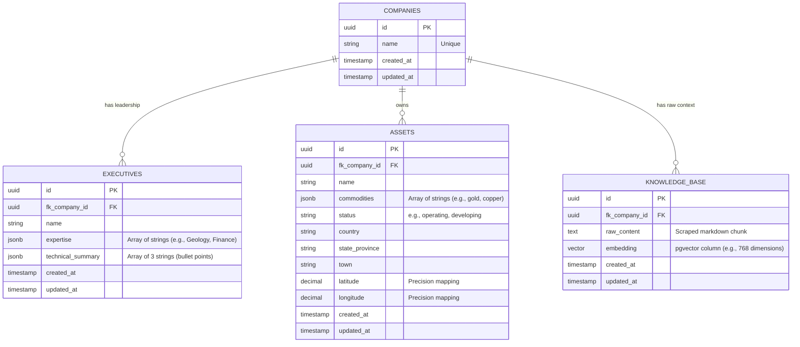

# Harpia Group - Mining Intelligence Data Pipeline

**Author:** Yann Gabriel  
**Challenge:** Technical Bounty - Mining Intelligence Data Pipeline (Search & Vectorization)

## 📌 Project Overview
This project is an end-to-end autonomous data pipeline designed to ingest a list of mining companies, search the web for relevant intelligence, and structure that unstructured data into a relational and vector database. The system extracts key information regarding the company's technical leadership and physical mining assets, serving it through a clean, lightweight user interface.

## 🏗️ Architecture & Tech Stack

While Python and Node.js are common defaults for orchestration, I intentionally architected this solution using **Laravel (PHP)** for the backend and orchestration, paired with **Angular** for the frontend and **Supabase (Postgres + pgvector)** for the database. 

### Strategic Architectural Decision: Why Laravel?
As an Architect, system design requires balancing perfect theoretical stacks with extreme pragmatism—especially within a strict 48-hour delivery window. I chose Laravel for the core orchestration engine due to the following strategic advantages:

1. **Pragmatism & Time-to-Market:** The evaluation criteria emphasize delivering a robust, working core model. Laravel's robust ecosystem (routing, ORM, migrations, and HTTP clients) allows for rapid, error-resilient scaffolding, freeing up the majority of the 48 hours to focus on the highest-value tasks: Prompt Engineering, Agentic Extraction, and Vector Search.
2. **Concurrent Processing (Bonus Point):** To process multiple companies simultaneously rather than sequentially, Laravel provides an enterprise-grade, built-in Queue system. By dispatching `ProcessCompanyIntelligence` jobs to background workers running in Docker, the pipeline scales horizontally and handles API rate limits efficiently.
3. **Resilience & Error Handling:** Dealing with LLMs and web scraping inherently involves failures (e.g., pages not listing assets, timeouts). Laravel's HTTP Client gracefully handles retries, timeouts, and payload validation, ensuring the pipeline doesn't break when encountering dirty unstructured data.

### The Stack:
* **Backend / Orchestrator:** Laravel 11 (REST API & Queue Workers)
* **Frontend:** Angular (Lightweight UI/Dashboard)
* **Database:** Supabase (PostgreSQL with `pgvector` for semantic search)
* **Search / Scrape:** Firecrawl API
* **Intelligence / LLM:** Google Gemini API (Structured Outputs & Embeddings)
* **Infrastructure:** Docker & Docker Compose

## ⚙️ Data Flow & Pipeline
1. **Input:** The UI accepts a comma-delimited string of company names (e.g., "BHP, Evolution Mining").
2. **Agentic Ingestion:** The backend dispatches a concurrent job for each company. It queries the Firecrawl API to search and scrape the most relevant pages regarding the Board of Directors and Mining Assets.
3. **Extraction & Intelligence:** The raw markdown is sent to the Gemini API. Strict prompt engineering forces the LLM to return structured JSON containing executives (with technical summaries) and assets (with coordinates).
4. **Vectorization:** The raw scraped data is chunked and embedded using Gemini's embedding model to enable semantic search.
5. **Storage:** Relational data and vector embeddings are stored in Supabase.

## 🗄️ Database Architecture & Schema

The database was modeled to be highly normalized, scalable, and tailored for both relational mapping and vector-based semantic search. 

### Entity-Relationship Diagram


### Migration Files
All migrations are located in `backend/database/migrations/`.

## 🚀 How to Run the Project

This project is fully containerized for a seamless setup. 

1. Clone the repository:
   ```bash
   git clone <repository-url>
   cd mining-pipeline
   ```